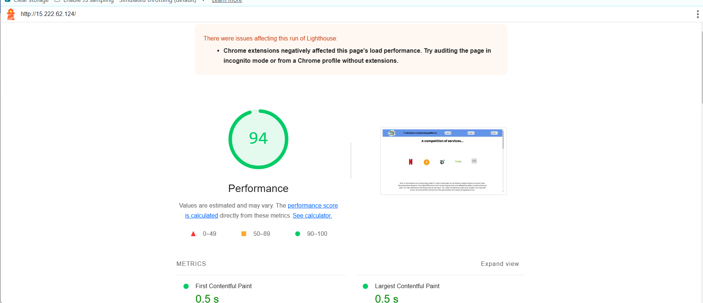
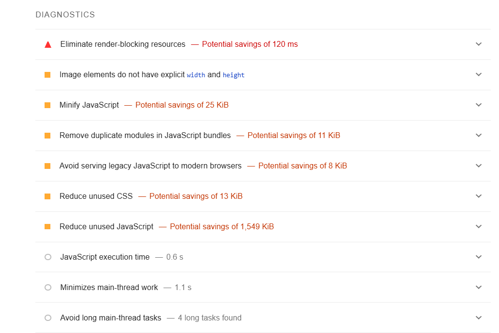
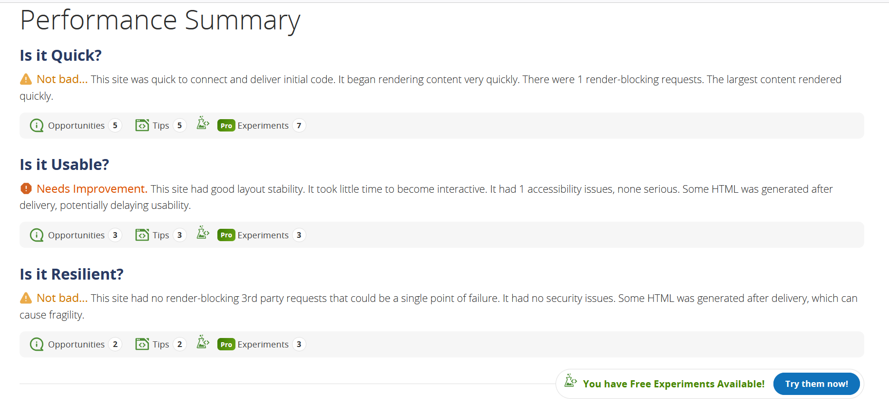

# Performance of Streaming VS Cable

## Introduction and Methodology

In chrome on a Windows 11 device with intel i7 core 13th gen CPU, using the lighthouse report, we performed an analysis on a viewport of 1280x752 with fast 4G throttle and gathered some critical information about our app performance.

### Before changes

<!-- Also report overall impact on whatdoesmysitecost results before and after all your changes -->

## Baseline Performance

The tool seemed to detect most of the visible performances, which make the website load visibly slower.

Through lighthouse, we observed some render-blocking JS and CSS, as well as some cross reference requests being made to other places, causing more DNS lookups and therefore lower performance.

Through whatdoesmysitecost, we observed the highest price point to be in Canada, at 0.22$.

## Areas to Improve

Because we already worked on performance in previous milestones, there wasnt much we were able to do to improve performance. As seen above, our before performance started off as a 94 already. After discussion, we agreed to remove the @import from the css file in order to remove that extra request. We also decided to seperate the more critical CSS with non-critical css to improve performance. Lastly, we implemented server-side and browser-side caching to further improve the constant querying of the database, as our dataset is very static.

In the last milestone, we also decided to use lazy imports for the graphs. More details below about the impacts of this change.

## Summary of Changes 

### Lazy imports for Plotly
Lead: Bianca Rossetti
Plotly is already a heavy library altogether, and because we only needed it later, we decided keeping it for the initial render was unnecessary. As such, we decided to use lazy imports. Once this change was implemented, it was clear the load time of our page decreased dramatically as we no longer relied the fairly heavy library for the initial load of our page.

### Use of critical css
Lead: Bianca Rossetti
Although our lighthouse score no longer showed "Eliminate render blocking resources", we found that it didnt really improve the score, nor did it reduce it. Depending on the device, it either had a very minor positive impact, or no impact on the lighthouse score. One major limitation is that this cannot be performed automatically through the pipeline, and users must extract the tar file to run the critical script before re-zipping and sending the final data to the deployment server.

### Making series and companies fetch in parallel instead of sequentially
Lead: Prabhjot Aulakh

Before, we fetch the series first, and then the companies inside the useEffect. 
Using a Promise.all, I made those 2 fetch requests in parallel. I didn't notice
a huge increase in performance. This may be because the fetch requests are rather
simple, since there isn't much querying going on for fetching all series and companies.
However, I still think this was a necessary change, as it would be more noticeable
if someone had network issues.

### Computing the graph and summary data in parallel
Lead: Prabhjot Aulakh

Before, we calculated the axies used for a graph in the useEffect inside the 
DataBlock component, and then we calculated the fetchSummaryData inside the child
Summary component. I hoisted the call to the function fetchSummaryData to the DataBlock, 
and ran it in parallel inside a Promise.all with the calculateAxies function. This 
had a great impact on performance, as the graph computed much faster when
we scrolled to it, and didn't glitch out the layout because it finished
calculating the axies before the summary data could be calculated. 

### Making some computations asynchronous
Lead: Prabhjot Aulakh

I made some synchronous functions that are exported inside the utils files asynchronous. This 
had a good impact on performance, as the computing of the graph was not done on the 
main thread, and allowed me to use Promise.all as specified above (since they were now 
returning promises.)

### Computing the graph only when scrolling near it, and not on page load
Lead: Prabhjot, Bianca

The use of intersection observer was accomplished the first phase by Prabhjot. The impact
on performance is unknown at that time. However, the use of intersection observer to compute
graph data and summary data only when you reach graph by scrolling was done by Bianca. This had 
a very good impact on initial page load, as all computations, styles and rendering of graphs
we're delayed and only what was above the fold (critical elements) were loaded. The result is that
we had a very fast page load time, which scores reaching 90+.

### Caching data after hovering on a data point
Lead: Prabhjot

When you hover on a point in the line charts, we make a fetch request each time. To reduce 
the overall number of requests made, I store the data in memory using hash maps once they have been
fetched. The result was that when a user re-visits a data point, the loading of the pop-up was 
near instant, instead of having a slight delay that usually comes with network requests. 

### Downloading custom fonts and saving them in the files
Lead: Adam 

Instead of using an import in the css to use fonts from google, the fonts are now saved in the
assests directory to reduce network calls when the page is loading.

## Conclusion

<!-- Summarize which changes had the greatest impact, note any surprising results and list 2-3 main 
things you learned from this experience. -->