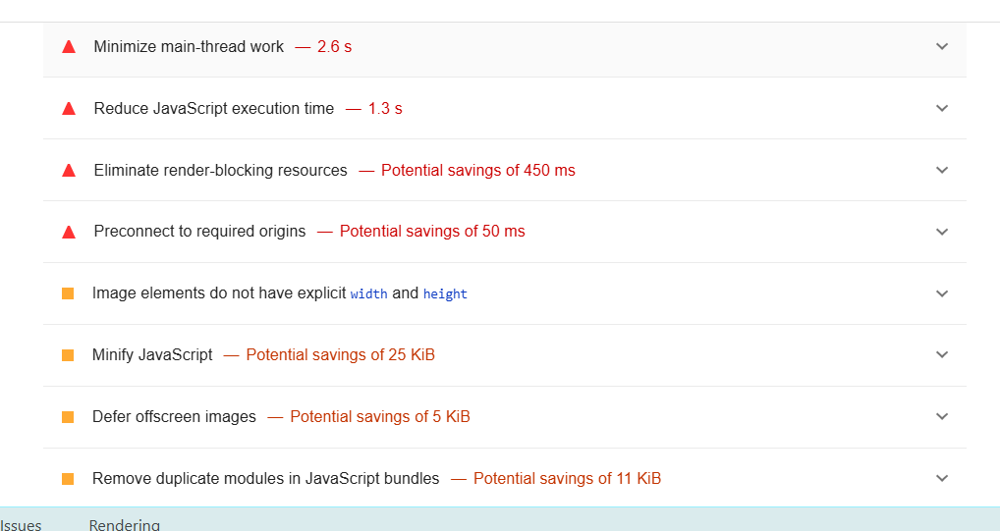

# Performance of Streaming VS Cable

## Introduction and Methodology

In chrome on a Windows 11 device with intel i7 core 13th gen CPU, using the lighthouse report, we performed an analysis on a viewport of 1280x752 with fast 4G throttle and gathered some critical information about our app performance.

<!-- Also report overall impact on whatdoesmysitecost results before and after all your changes -->

## Baseline Performance

The tool seemed to detect most of the visible performances, which make the website load visibly slower.

Through lighthouse, we observed some render-blocking JS and CSS, as well as some main thread work that was taking up a lot of the load time.

As for WhatDoesMySiteCost? We could not get the report to load because the page kept freezing on us. We tried on all our computers on several browsers with no success.

## Areas to Improve

We need to improve where we execute our heavy js calculations (and offload them asynchronously) as well as focus on rendering only the critical CSS first and the non-critical css later. We will also remove the imports for fonts and download them instead, as this was causing problems as well.

## Summary of Changes 

<!-- Briefly describe each change and the impact it had on performance (be specific). If there
was no performance improvement, explain why that might be the case -->

### Making series and companies fetch in parallel instead of sequentially

Lead: Prabhjot Aulakh

Before, we fetch the series first, and then the companies inside the useEffect. 
Using a Promise.all, I made those 2 fetch requests in parallel. I didn't notice
a huge increase in performance. This may be because the fetch requests are rather
simple, since there isn't much querying going on for fetching all series and companies.
However, I still think this was a necessary change, as it would be more noticeable
if someone had network issues.

### Computing the graph and summary data in parallel

Lead: Prabhjot Aulakh

Before, we calculated the axies used for a graph in the useEffect inside the 
DataBlock component, and then we calculated the fetchSummaryData inside the child
Summary component. I hoisted the call to the function fetchSummaryData to the DataBlock, 
and ran it in parallel inside a Promise.all with the calculateAxies function. This 
had a great impact on performance, as the graph computed much faster when
we scrolled to it, and didn't glitch out the layout because it finished
calculating the axies before the summary data could be calculated. 

### Making some computations asynchronous

Lead: Prabhjot Aulakh

I made some synchronous functions that are exported inside the utils files asynchronous. This 
had a good impact on performance, as the computing of the graph was not done on the 
main thread, and allowed me to use Promise.all as specified above (since they were now 
returning promises.)

### Computing the graph only when scrolling near it, and not on page load

Lead: Prabhjot, Bianca

The use of intersection observer was accomplished the first phase by Prabhjot. The impact
on performance is unknown at that time. However, the use of intersection observer to compute
graph data and summary data only when you reach graph by scrolling was done by Bianca. This had 
a very good impact on initial page load, as all computations, styles and rendering of graphs
we're delayed and only what was above the fold (critical elements) were loaded. The result is that
we had a very fast page load time, which scores reaching 90+.

### Caching data after hovering on a data point

Lead: Prabhjot

When you hover on a point in the line charts, we make a fetch request each time. To reduce 
the overall number of requests made, I store the data in memory using hash maps once they have been
fetched. The result was that when a user re-visits a data point, the loading of the pop-up was 
near instant, instead of having a slight delay that usually comes with network requests. 

### Intersection observer for viewing search results

Lead: Prabhjot

## Conclusion

<!-- Summarize which changes had the greatest impact, note any surprising results and list 2-3 main 
things you learned from this experience. -->